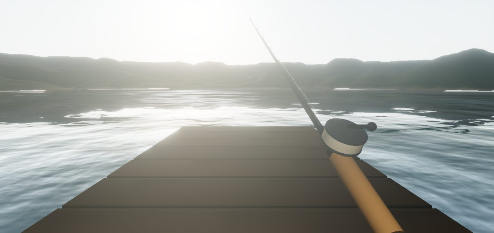

# 🎣 FishingF'reel

> A genuinely beautiful, browser-based 3D first-person fishing game. Graphics-first, runs anywhere, no installer.

Cast off a dock on a calm lake at golden hour, work the lure, feel the bite, and fight the fish through a real tension/drag loop. Built with React Three Fiber and Three.js, deployable as a static site to GitHub Pages, Cloudflare Pages, Render, or any static host.



---

## ▶️ Play

- **Live demo:** _coming soon_ (GitHub Pages auto-deploys from `main`)
- **Run locally:** see [Quick start](#-quick-start)

## ✨ Features

- **Hero water + sky** — depth-graded water, Fresnel reflections, sun specular glitter, a physical sky shader, and a living day/night cycle driving the sun light, fog, and ambient color.
- **First-person rig** — FPS-style mouse-look + WASD walking on real terrain and dock, with eye height that follows the ground.
- **Full fishing loop** — aim & power cast, line arc, bobber ripples, bite detection, and a reel-in tension minigame where you fight the fish without snapping the line.
- **Tackle & progression** — rods, reels, lines, lures/bait, fish species with size/strength, XP, an angler log, a map panel, and a tackle box bench.
- **Post-processing** — ACES filmic tone mapping, bloom, SMAA, with adaptive resolution to hold framerate on integrated GPUs.

## 🎮 Controls

| Action | Mouse | Keyboard |
|---|---|---|
| Capture cursor | Click the scene | — |
| Look around | Move mouse | — |
| Move | — | `W` `A` `S` `D` |
| Cast / Reel | Hold **Left** — charge & release to cast, hold to reel | Hold `Space` |
| Twitch lure / Set the hook | **Right** | `E` |
| Tackle box | — | `I` / `B` / `Tab` |
| Map | — | `M` |
| Angler log | — | `L` |
| Settings | — | `Esc` |

## 🚀 Quick start

```bash
git clone https://github.com/lordbasilaiassistant-sudo/fishing-freel.git
cd fishing-freel
npm install
npm run dev      # start the Vite dev server (http://localhost:5173)
```

Build a static production bundle:

```bash
npm run build    # outputs to dist/
npm run preview  # serve the production build locally
```

## 🌐 Deploy

### Deploy to Render (one click)

[](https://render.com/deploy?repo=https://github.com/lordbasilaiassistant-sudo/fishing-freel)

The included [`render.yaml`](render.yaml) blueprint provisions a free static site (`npm run build` → `dist/`).

### GitHub Pages (automatic)

Pushing to `main` triggers [`.github/workflows/deploy-pages.yml`](.github/workflows/deploy-pages.yml), which builds and publishes to GitHub Pages. Enable it once under **Settings → Pages → Source: GitHub Actions**.

### Any static host

`npm run build` produces a fully static `dist/` with relative asset paths (`base: './'`), so you can drop it on Cloudflare Pages, Netlify, Vercel, Fly.io, or a plain file server.

## 🧱 Tech stack

| | |
|---|---|
| Rendering | [Three.js](https://threejs.org) + [React Three Fiber](https://r3f.docs.pmnd.rs) |
| Helpers | [`@react-three/drei`](https://github.com/pmndrs/drei), [`@react-three/postprocessing`](https://github.com/pmndrs/postprocessing), [`@react-three/rapier`](https://github.com/pmndrs/react-three-rapier) |
| State | [zustand](https://github.com/pmndrs/zustand) (localStorage persistence) |
| Build | [Vite](https://vite.dev) |
| Dev tuning | [leva](https://github.com/pmndrs/leva) (hidden by default) |

See [`DESIGN.md`](DESIGN.md) for the design philosophy and roadmap.

## 🤝 Contributing

Issues and PRs welcome — see [`CONTRIBUTING.md`](CONTRIBUTING.md). The build order and roadmap live in [`DESIGN.md`](DESIGN.md).

## 📦 Releases

Tagged releases (`v*`) automatically build and attach a zipped static bundle via [`.github/workflows/release.yml`](.github/workflows/release.yml). Grab the latest from the [Releases page](https://github.com/lordbasilaiassistant-sudo/fishing-freel/releases).

## 📄 License

[MIT](LICENSE) © Anthony Snider. Built with [Claude Code](https://claude.com/claude-code).
